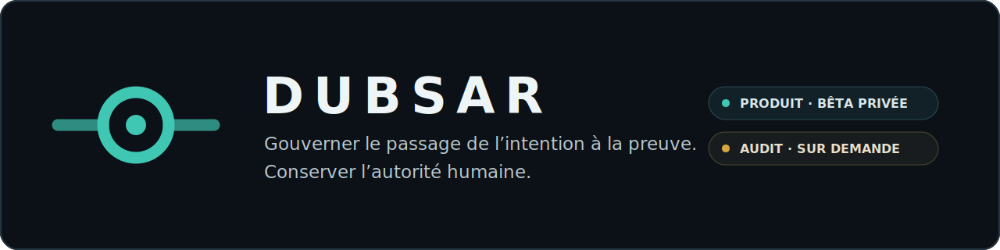

  

# DUBSAR

**Gouverner le passage de l’intention à la preuve. Conserver l’autorité humaine.**

DUBSAR rend les projets logiciels construits avec des agents de code plus explicables, vérifiables et contrôlables dans la durée.

Deux voies sont proposées aujourd’hui :

| Produit | Prestation professionnelle |
|---|---|
| **DUBSAR pour Claude Code** — bêta privée contrôlée pour gouverner un projet réel pendant sa construction. | **Audit DUBSAR** — audit borné et étayé par des preuves sur la préparation au lancement ou la gouvernance des agents. |
| Sur invitation · Windows en premier | Sur demande · À distance · Lecture seule par défaut |

[Demander un accès bêta](https://dubsar.ai/fr/early-access) · [Demander un audit](https://dubsar.ai/fr/audit) · [Documentation anglaise](README.md)

## Le problème traité

Les agents accélèrent la production. Ils ne garantissent pas à eux seuls la continuité, la preuve ni l’autorité.

D’une session ou d’un outil à l’autre, un projet peut perdre sa Mission, ses contraintes, les raisons de ses décisions, la provenance des preuves, ses contradictions et ses validations humaines.

DUBSAR ajoute une couche de gouvernance durable autour des agents existants :

- Mission persistante et mémoire des décisions ;
- travail borné et contrats explicites ;
- identité des sessions ;
- preuves reliées aux sources et versions ;
- contradictions et limites visibles ;
- reprise et rejeu ;
- Human Gates pour les décisions protégées.

**Les agents proposent. DUBSAR préserve et vérifie. L’humain décide.**

## Le produit

Claude Code est la première intégration. La bêta privée fonctionnelle est en cours de finalisation pour des projets extérieurs sélectionnés, avec Windows comme première cible.

Les preuves techniques internes à une et deux sessions sont acquises. L’installation et l’expérience autonome d’un utilisateur extérieur restent à valider avant toute ouverture publique de la Marketplace.

Codex, Cursor et d’autres environnements font partie de la direction future. Ils ne sont pas présentés comme des intégrations disponibles aujourd’hui.

## La prestation d’audit

L’Audit DUBSAR est une prestation opérée par Sofiane avec DUBSAR. Il répond à l’une de ces questions :

1. **Préparation au lancement** — le produit est-il réellement prêt à être ouvert aux utilisateurs ?
2. **Gouvernance des agents** — l’équipe peut-elle expliquer et vérifier comment le projet a été construit et validé ?

L’audit examine uniquement les sources autorisées dans un mandat défini. Le rapport distingue les faits, les inférences, les preuves, les contradictions, les limites et les décisions humaines.

Pour un audit de préparation au lancement, le verdict est **GO, GO sous conditions ou NO-GO**.

La prestation est disponible sur demande, réalisée à distance et en lecture seule par défaut. Aucun résultat final n’est livré sans revue humaine.

[Méthode d’audit](AUDIT.fr.md) · [Demander un audit](https://dubsar.ai/fr/audit)

## Limites actuelles

- le produit Claude Code n’est pas encore une installation publique autonome ;
- la Marketplace publique n’est pas activée ;
- le Core reste propriétaire et privé ;
- DUBSAR ne remplace pas le développeur ou l’autorité technique du client ;
- DUBSAR ne certifie pas la conformité et ne garantit pas l’absence de défaut ou de vulnérabilité.

## Créateur

Créé par **Sofiane Kotni**.

Site : [dubsar.ai](https://dubsar.ai/fr/) · Contact : [contact@dubsar.ai](mailto:contact@dubsar.ai)
