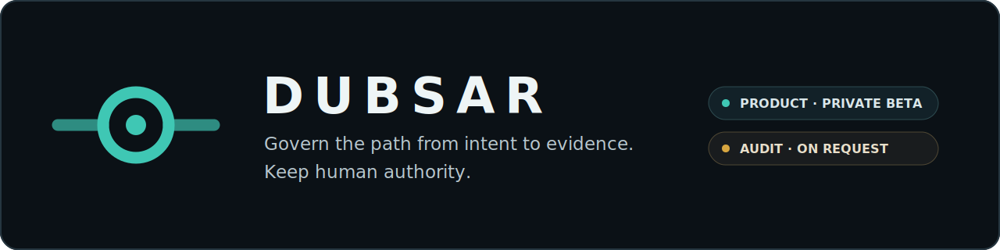

<p align="center">
  
</p>

# DUBSAR

**Govern the path from intent to evidence. Keep human authority.**

DUBSAR makes software projects built with coding agents easier to explain, review and control over time.

It is one governance system with two current ways to work with it:

| Product | Professional service |
|---|---|
| **DUBSAR for Claude Code** — a controlled private beta for governing real projects while they are being built. | **DUBSAR Audit** — a bounded, evidence-backed audit of launch readiness or agent governance. |
| Invitation only · Windows first | Available on request · Remote · Read-only by default |

[Request private beta access](https://dubsar.ai/early-access) · [Request an audit](https://dubsar.ai/audit) · [Version française](README.fr.md)

---

<p align="center">
  
</p>

---

## Why DUBSAR exists

Coding agents can plan, edit and test quickly. Long-running projects face a different problem: continuity, proof and authority.

Across sessions and tools, a project can lose:

- the Mission and active constraints;
- decisions and their reasons;
- the relationship between claims and verified evidence;
- contradictions between tickets, documentation, code and tests;
- pending Human Gates;
- the path needed to resume or explain the project later.

DUBSAR adds a durable governed project layer around existing coding agents:

- persistent Mission and decision memory;
- bounded work and explicit contracts;
- canonical session identity;
- evidence tied to sources and versions;
- visible contradictions and limitations;
- replay across sessions;
- explicit Human Gates for protected movement.

**Agents propose. DUBSAR preserves and checks. Humans decide.**

DUBSAR is not another coding agent and does not replace the developer.

---

## Path 1 — DUBSAR for Claude Code

Claude Code is the first product integration.

```text
Claude Code
    ↓
DUBSAR plugin
    ↓
Local Bridge and DUBSAR Desktop
    ↓
Protected Backend
    ↓
Private DUBSAR Core
    ↓
Mission, decisions, evidence and Human Gates
```

The integration is a **functional private beta being finalized for selected external projects**. Windows is the first supported target. Public Marketplace installation is not active yet.

Internal Windows validation has completed governed one-session and two-session execution with distinct identities, isolated worktrees, separated evidence, explicit conflict handling, Human Gates and restart reconciliation.

That is a technical proof, not a claim that anyone can already install the product independently. External installation and usability validation remain in progress.

[Product surfaces](PRODUCT_SURFACES.md) · [Current status](STATUS.md) · [Installation boundary](INSTALLATION.md)

---

## Path 2 — DUBSAR Audit

DUBSAR Audit is a professional service operated by Sofiane with DUBSAR.

It answers one of two bounded questions:

1. **Launch readiness** — Is the product genuinely ready to open to users?
2. **Agent governance** — Can the team explain and verify how the project was built and approved?

The audit examines only authorized sources under an agreed mandate. Depending on the client environment, those sources may include GitHub, Jira, Confluence, Linear, Notion, Slack or Google Drive.

The deliverable separates:

- observed facts;
- inferences;
- evidence and provenance;
- contradictions;
- limitations and unavailable sources;
- human decisions.

For launch-readiness mandates, the conclusion is **GO, GO under conditions or NO-GO**, supported by prioritized findings and an evidence register.

The service is remote, bounded and read-only by default. No final conclusion is delivered without human review.

[How DUBSAR Audit works](AUDIT.md) · [Request an audit](https://dubsar.ai/audit)

---

## One method, different maturity

The product and the service use the same governance discipline, but they do not have the same availability status.

```text
DUBSAR product for Claude Code: controlled private beta being finalized
DUBSAR Audit: professional service available on request
Public Marketplace: not activated
Codex / Cursor adapters: future product direction
Private Core: proprietary and not distributed here
```

The audit service does not pretend that the private beta is a mature enterprise platform. It uses DUBSAR as a governed operator system, together with authorized project sources and human validation, to produce a professional result.

---

## Product direction

DUBSAR is designed around host adapters rather than a Core tied permanently to Claude Code.

Codex, Cursor and other coding-agent environments are part of the direction, but they are not currently supported public integrations.

The long-term product remains DUBSAR itself: a governance layer for agent-assisted software projects. The audit service is a professional application of that system and a way to validate it on real projects.

---

## What DUBSAR does not claim

DUBSAR does not:

- replace coding agents, developers or client technical authority;
- allow an agent to approve its own work;
- treat persuasive wording as proof;
- silently merge, release or deploy;
- certify regulatory compliance;
- guarantee defect-free or secure code;
- expose the proprietary Core;
- claim that Codex or Cursor adapters are already available.

---

## Public / private boundary

This repository is the public documentation and distribution boundary for DUBSAR. It may contain:

- product doctrine and architecture;
- bounded examples and diagrams;
- public security, privacy and installation information;
- the thin Claude Code host adapter and Marketplace metadata when publication is authorized.

It does not publish:

- the proprietary DUBSAR Core;
- private Backend implementation details;
- internal policies, prompts or sealed journals;
- confidential client or tester data;
- secrets, tokens or trust material.

Some technical identifiers still use `scribe` for compatibility. They are legacy implementation names, not a second public product.

---

## Documentation

### Start here

1. [Why DUBSAR?](WHY_DUBSAR.md)
2. [DUBSAR Audit](AUDIT.md)
3. [Product and surfaces](PRODUCT_SURFACES.md)
4. [Current status](STATUS.md)
5. [Architecture](ARCHITECTURE.md)
6. [FAQ](FAQ.md)
7. [Roadmap](ROADMAP.md)

### Distribution and trust

- [Installation](INSTALLATION.md)
- [Marketplace](MARKETPLACE.md)
- [Security](SECURITY.md)
- [Privacy](PRIVACY.md)
- [Integrity and provenance](INTEGRITY.md)

### Doctrine

- [Principles](PRINCIPLES.md)
- [Decision memory](DECISION_MEMORY.md)
- [Design philosophy](DESIGN_PHILOSOPHY.md)
- [Why not just agents?](WHY_NOT_JUST_AGENTS.md)
- [Manifesto](MANIFESTO.md)

---

## Created by

Created by **Sofiane Kotni**.

Website: [dubsar.ai](https://dubsar.ai) · Contact: [contact@dubsar.ai](mailto:contact@dubsar.ai)
