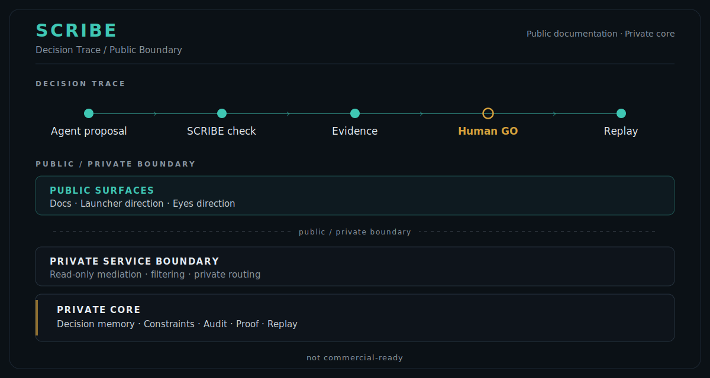

# SCRIBE

**Decision memory and audit for AI-driven software projects.**

Your AI agent moves fast.  
SCRIBE keeps it from forgetting, breaking things, or merging too early.

Agents propose. SCRIBE checks. Humans decide.

**Public documentation · Private core · not commercial-ready**

---

<p align="center">
  
</p>

---

## What is SCRIBE?

SCRIBE is an engineering exploration for long-running software projects built with AI coding agents.

It is not another AI coding agent. It does not replace Claude Code, Codex, Cursor or a developer. It is a decision-memory, audit and human-validation layer around AI-assisted development workflows.

AI agents can write code, refactor files, draft plans and audit pull requests quickly. The harder problem is continuity:

- what was decided;
- which constraints were locked;
- what evidence was available;
- what changed;
- what still requires Human GO;
- what can be replayed later.

SCRIBE explores that layer.

---

## Decision Trace / Checkpoint Grammar

SCRIBE is built around a simple project grammar:

```text
Memory -> Locked constraints -> Agent proposal -> Audit -> Evidence -> Human GO -> Replay
```

The number of agents is not the central question. A project may use one agent or several. In both cases, the project still needs memory, boundaries, evidence and explicit human decision before critical movement.

```text
Agent proposes
  -> SCRIBE checks memory, constraints and evidence
  -> Human GO is required before protected project movement
  -> The decision path remains replayable
```

SCRIBE does not let an AI system validate itself.

---

## The problem SCRIBE addresses

In short conversations, AI can be extremely useful.

In long-running projects, the failure mode changes.

The risk is no longer only that a model gives a bad answer. The risk is that a project slowly drifts while every individual answer still looks reasonable:

- a locked rule disappears from the next prompt;
- a previous decision is forgotten;
- a refactor touches a forbidden area;
- a pull request looks technically plausible but moves the project in the wrong direction;
- a merge happens before the human decision is clear.

SCRIBE exists for that gap between fast AI output and reliable project movement.

---

## Current product direction

The current public product direction is not an autonomous multi-agent platform.

SCRIBE is moving toward a hybrid model:

```text
Existing AI coding workflow
        ↓
SCRIBE Launcher / connector surface
        ↓
Private service boundary
        ↓
Private SCRIBE decision core
        ↓
Evidence, memory and Human GO surfaced for review
```

### SCRIBE Launcher

SCRIBE Launcher is the first product surface being explored.

It is a thin guardrail / connector surface around existing AI coding workflows. Depending on the host environment, future delivery forms may include a connector, plugin or MCP-compatible integration.

It is not a public installable product today. There is no stable public connector API, no public package and no production-ready integration.

### Eyes of SCRIBE

Eyes of SCRIBE is the cockpit / observation direction.

Its purpose is to show what SCRIBE has seen, checked, excluded, evidenced and left for Human GO. It is a decision and audit surface, not an autonomous execution engine.

This direction is still under active development.

See [Product Surfaces](PRODUCT_SURFACES.md) for the current public framing.

---

## Public / private boundary

This repository is a public boundary for SCRIBE.

It contains:

- public positioning;
- public principles;
- conceptual architecture;
- decision-memory documentation;
- public diagrams;
- public RFCs;
- non-sensitive examples.

It does not publish:

- the private SCRIBE core;
- backend implementation details;
- internal audit logs;
- sealed project journals;
- private prompts or policies;
- confidential proof artifacts;
- operational write mechanisms;
- trust, signing or secret material.

This repository is publicly viewable documentation. It is not an open-source release of the SCRIBE core and it does not contain an installable product package.

---

## What SCRIBE is not

SCRIBE is not:

- a replacement for developers;
- an autonomous coding platform;
- a marketplace of AI agents;
- a claim that AI can self-govern;
- a commercial-ready product;
- a public release of the private engine.

The private implementation remains under active development.

---

## Visual overview

The diagrams in this repository are public explanatory material. Some older diagrams still reflect the earlier “governed collaboration loop” framing and should be read as conceptual / legacy notes, not as the current product architecture.

More public diagrams are available in the [diagrams folder](diagrams/):

- [Conceptual Architecture](diagrams/architecture.svg) — legacy conceptual framing;
- [Governed Collaboration Loop](diagrams/governed-loop.svg) — legacy role-separation framing;
- [Decision Memory](diagrams/decision-memory.svg) — still aligned conceptually;
- [Execution Contract](diagrams/execution-contract.svg) — still aligned conceptually;
- [Project Evolution](diagrams/project-evolution.svg) — legacy trajectory note.

Direct links to `.svg` files may open as source text in some mobile GitHub views. For visual previews, open this README or the [diagrams README](diagrams/README.md).

---

## Public RFCs

The [public RFCs](rfcs/README.md) are the public technical specification layer of SCRIBE.

They define concepts, invariants, abstract record shapes, failure modes and review criteria.

They are written for technical readers.

They do not publish the private engine.

They do not expose internal gates, prompts, sealed journals, signing material, provider details, proof artifacts or operational write mechanisms.

---

## Public documentation

Recommended reading order:

### Start here

1. [Why SCRIBE?](WHY_SCRIBE.md)
2. [Product Surfaces](PRODUCT_SURFACES.md)
3. [FAQ](FAQ.md)
4. [Status](STATUS.md)
5. [Roadmap](ROADMAP.md)

### Core concepts

6. [Principles](PRINCIPLES.md)
7. [Architecture](ARCHITECTURE.md)
8. [Decision Memory](DECISION_MEMORY.md)
9. [Design Philosophy](DESIGN_PHILOSOPHY.md)
10. [Why not just agents?](WHY_NOT_JUST_AGENTS.md)

### Public references

11. [Manifesto](MANIFESTO.md)
12. [Governed Multi-Change Demo](examples/governed-multi-change/README.md)
13. [Diagrams](diagrams/README.md)
14. [Public RFCs](rfcs/README.md)

---

## Current status

SCRIBE is experimental.

It is not commercial-ready.

There is currently no public installation package, no stable public API, no production deployment and no commercial availability.

The public repository is intentionally limited to non-sensitive material. It explains the public doctrine and product direction without exposing the proprietary core.

---

## Long-term direction

SCRIBE begins with AI-assisted software development.

The broader question is larger:

How should humans and AI build together when projects last longer than a single chat, a single pull request or a single agent session?

The hypothesis explored here is that reliable AI collaboration requires more than better models. It requires memory, constraints, evidence, replay and human decision.

Intelligence produces proposals.

SCRIBE keeps project movement bounded by memory, proof and Human GO.

---

## Created by

Created by Sofiane Kotni.
