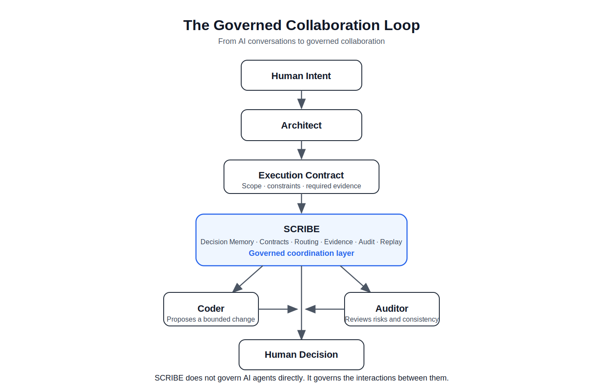

# SCRIBE Builder

**A governed coordination layer for AI-driven software development.**

Agents do not self-validate.

SCRIBE routes proposals through memory, contracts, audit, evidence and human decision.

---

## What is SCRIBE Builder?

SCRIBE Builder is an engineering exploration around a simple problem:

How can humans and AI systems collaborate reliably on software projects that last weeks, months or years?

AI models can produce code, explanations, audits and architectural proposals. But long-running projects need more than isolated answers. They need continuity, memory, contracts, evidence and human judgment.

SCRIBE Builder explores a governed collaboration loop where AI roles can contribute without becoming independent authorities.

---

## The core idea

SCRIBE is not another AI agent.

It is a governed coordination layer between AI agents and human decisions.

Its purpose is to structure how proposals move through a project:

```text
Human Intent
  -> Architect
  -> Execution Contract
  -> SCRIBE
  -> Coder / Auditor
  -> Evidence
  -> Human Decision
  -> Controlled Execution
  -> Replay
```

SCRIBE does not govern AI agents directly.

It governs the interactions between them.

---

## Visual overview



More public diagrams are available in the [diagrams folder](diagrams/):

- [Conceptual Architecture](diagrams/architecture.svg)
- [Decision Memory](diagrams/decision-memory.svg)
- [Execution Contract](diagrams/execution-contract.svg)
- [Project Evolution](diagrams/project-evolution.svg)

---

## Why this matters

In short conversations, AI can be extremely useful.

In long-running projects, the problem changes.

The challenge is no longer only whether a model can answer.

The challenge becomes whether the project can remember why a decision was made, check proposals against prior constraints, preserve evidence, support human approval and replay the decision path later.

Without this structure, projects can drift even when every individual AI response appears reasonable.

---

## Decision memory

SCRIBE treats decision memory as a first-class component of AI-assisted software development.

Conversation history is not enough.

A project should remember what was decided, why it was decided, what evidence supported the decision, who approved it, what changed afterward and what can be replayed.

Conversations disappear.

Decisions remain.

---

## What SCRIBE is not

SCRIBE Builder is not:

- a replacement for developers;
- an autonomous coding platform;
- a marketplace of AI agents;
- a claim that AI can self-govern;
- a commercial-ready product;
- a public release of the private engine.

This repository documents the concepts, principles and architecture behind the project.

The private implementation remains under active development.

---

## Public documentation

Recommended reading order:

1. [Why SCRIBE?](WHY_SCRIBE.md)
2. [Manifesto](MANIFESTO.md)
3. [Principles](PRINCIPLES.md)
4. [Architecture](ARCHITECTURE.md)
5. [Decision Memory](DECISION_MEMORY.md)
6. [Why not just agents?](WHY_NOT_JUST_AGENTS.md)
7. [Design Philosophy](DESIGN_PHILOSOPHY.md)
8. [FAQ](FAQ.md)
9. [Roadmap](ROADMAP.md)
10. [Status](STATUS.md)
11. [Governed Multi-Change Demo](examples/governed-multi-change/README.md)

---

## Current status

SCRIBE Builder is experimental.

It is not commercial-ready.

The public repository is intentionally limited to non-sensitive material. It does not contain the private engine, internal audit logs, sealed project journals, private prompts, confidential proof artifacts or implementation details that are still evolving.

---

## Long-term direction

SCRIBE Builder begins with software development.

The broader question is larger:

How should humans and AI build together?

The hypothesis explored here is that reliable AI collaboration requires more than better models. It requires memory, contracts, evidence, replay and human decision.

Intelligence produces proposals.

Governance produces reliable systems.

---

## Created by

Created by Sofiane Kotni.
