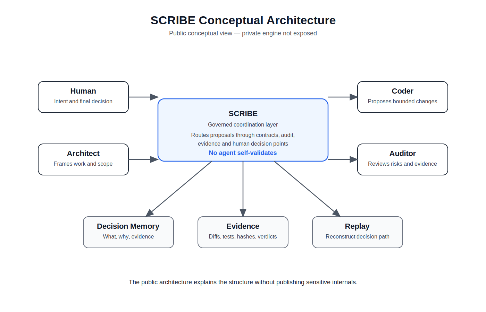
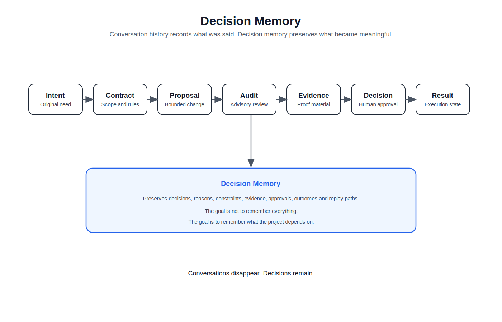
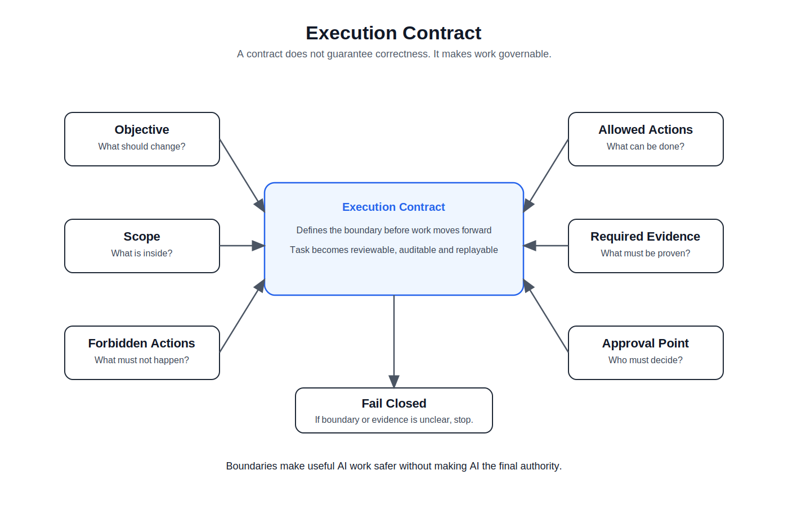
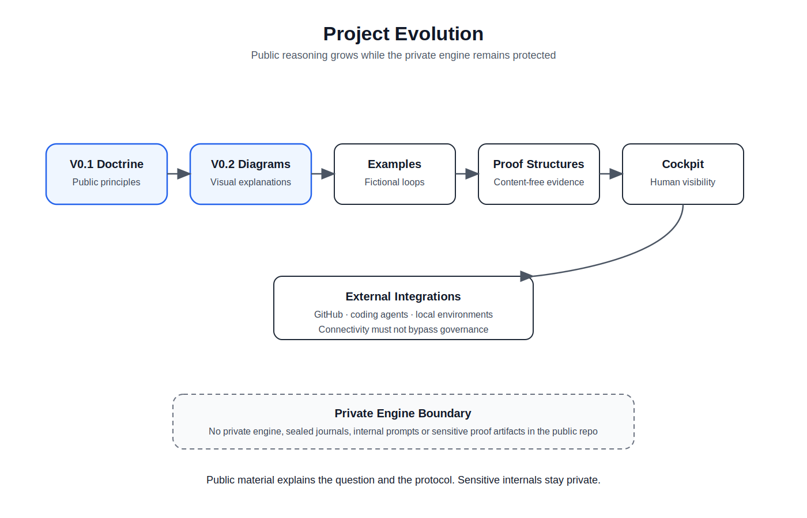

# Diagrams

This folder contains simple public diagrams for SCRIBE Builder.

The diagrams are sober, readable and conceptual.

They explain the governed collaboration loop without exposing the private engine.

## Preview

### Governed Collaboration Loop

### Conceptual Architecture

### Decision Memory

### Execution Contract

### Project Evolution

## Files

- [Governed Collaboration Loop](governed-loop.svg)
- [Conceptual Architecture](architecture.svg)
- [Decision Memory](decision-memory.svg)
- [Execution Contract](execution-contract.svg)
- [Project Evolution](project-evolution.svg)

## Boundary

These diagrams are public explanatory material.

They do not publish the private engine, internal audit logs, sealed journals, private prompts or confidential proof artifacts.
