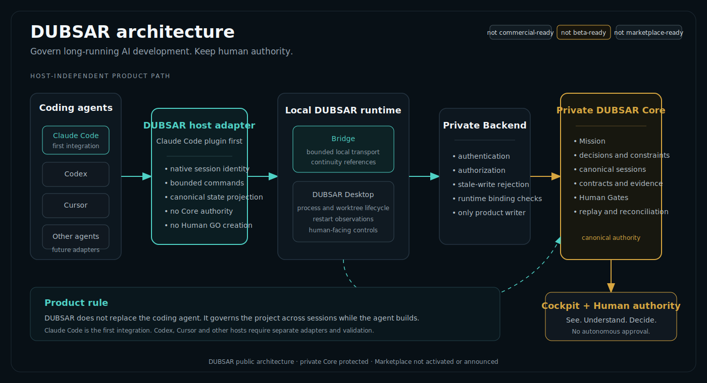
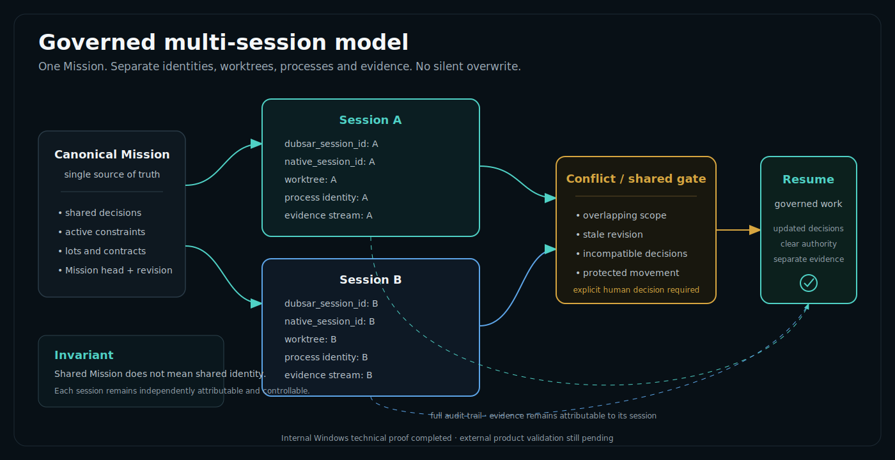
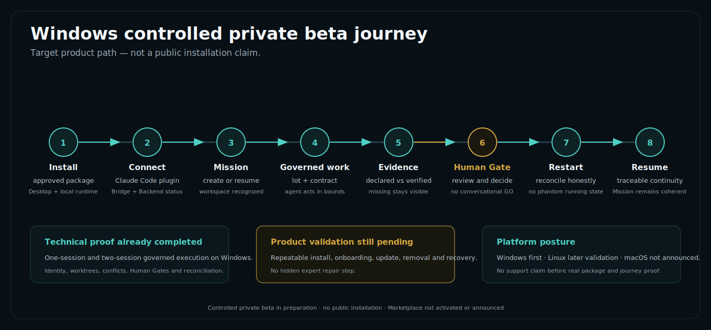

# DUBSAR diagrams

This folder now contains the first canonical public DUBSAR visual set.

The diagrams are explanatory product documentation. They do not expose private Core logic, Backend routes, internal policies, confidential proof artifacts, secrets or tester data.

## Canonical visuals

### 1. Product architecture



Explains the real responsibility chain:

```text
Coding agent
  → DUBSAR host adapter
  → local Bridge and runtime
  → private Backend
  → private DUBSAR Core
  → cockpit and human authority
```

Claude Code is shown as the first integration. Codex, Cursor and other coding agents are clearly marked as future adapters rather than current availability.

### 2. Governed multi-session model



Shows one canonical Mission with:

- separate session identities;
- separate worktrees and processes;
- attributable evidence streams;
- explicit conflict handling;
- shared Human Gate when required;
- governed resume without silent overwrite.

The diagram reflects an internal Windows technical proof, not a public beta claim.

### 3. Windows controlled private-beta journey



Shows the target user path:

```text
Install
  → Connect
  → Mission
  → Governed work
  → Evidence
  → Human Gate
  → Restart
  → Resume
```

It distinguishes completed internal technical proof from product validation still pending.

## Visual system

The canonical DUBSAR visual language uses:

- dark graphite and night-blue backgrounds;
- restrained turquoise for product flows and active state;
- warm gold for evidence and Human Gates;
- clear typography and bounded information density;
- no purple, excessive neon or generic SaaS styling.

## Legacy files

The older SVG files in this folder were created during SCRIBE / Scribe Builder phases.

They are historical and must not be treated as current DUBSAR product architecture. They should later be:

- moved to an explicit legacy archive;
- redrawn under DUBSAR when the concept remains useful; or
- removed when they no longer add value.

The root README embeds only the canonical DUBSAR architecture visual.

## Current status

```text
Windows controlled private beta: in preparation
Marketplace: not activated or announced
product generally available: no
public beta: no
marketplace-ready: no
```
